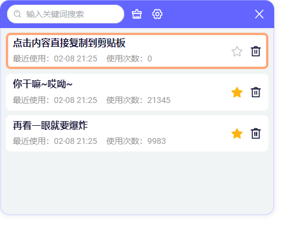
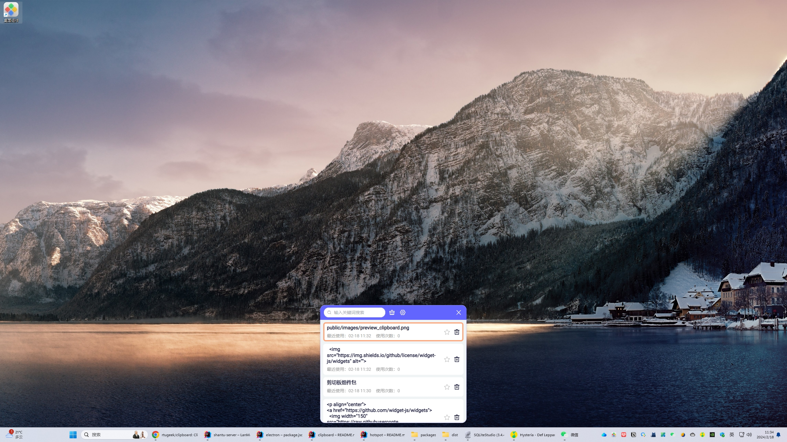

 
桌面组件 - 剪切板组件包

  
  
 
 
 

### 说明

这是剪切板组件包，包含剪切板历史记录、搜索、收藏等功能。
全部开源组件仓库在这：https://github.com/widget-js/widgets

### Windows 10/11 客户端下载

- https://www.microsoft.com/store/productId/9NPR50GQ7T53
- 或
- https://widgetjs.cn

